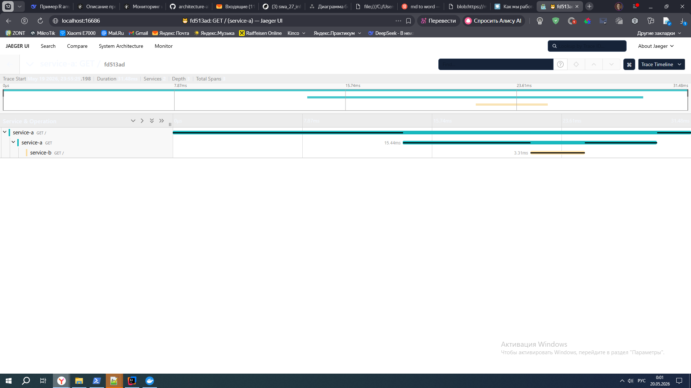

Задание 3. Трейсинг

Команда видит, что заказы часто находятся в непонятном состоянии или зависают на каком-то сервисе внутри IT-ландшафта. Проблемы с заказами могут появляться и вовсе только потому, что сообщения теряются.
Вам необходимо внедрить инструмент, с помощью которого команда сможет увидеть, что происходило с заказом и где он находится сейчас.

Что нужно сделать
- Создайте в директории Task3 текстовый файл «Архитектурное решение по трейсингу». В нём вы будете работать над заданием
- Проанализируйте систему компании и C4-диаграмму в контексте планирования трейсинга. Напишите и выделите на схеме системы, которые следует покрыть трейсингом. Для этого идентифицируйте места, где заказ может «сломаться» или зависнуть.
- Составьте список данных, которые должны попадать в трейсинг.
- Добавьте в документ раздел «Мотивация». Напишите здесь, почему в систему нужно добавить трейсинг и что это даст компании. Опишите возможные три-пять технические и бизнес-метрики решения, на которые повлияет внедрение трейсинга.
- Добавьте раздел «Предлагаемое решение». Опишите, как и с помощью каких технологий будет реализован трейсинг, какие компоненты нужно внедрить или доработать. Отразите компоненты и новые связи на схеме. Скачайте диаграмму контейнеров «Александрита» в модели C4. Доработайте диаграмму, исходя из вашего решения: отразите на ней новые компоненты и связи. Новые элементы выделяйте красным цветом — так ревьюеру будет проще проверить вашу работу. Когда схема будет готова, добавьте ссылку на неё в раздел «Предлагаемое решение».
- Добавьте раздел «Компромиссы». Опишите, в каких случаях трейсинг не принесёт пользы или пока невозможен, или его реализация обойдётся слишком дорого.
- Например, сложно заставить проприетарную систему отдавать метрики в нужном формате, может потребоваться дорогостоящая доработка.
- Проработайте аспекты безопасности. Опишите, какие меры для предотвращения несанкционированного доступа будут предусмотрены для системы трейсинга внутри компании и снаружи если это требуется.
Например: «Внедрение аутентификации — зайти в систему смогут только сотрудники компании с актуальной учетной записью и ролью “Поддержка”».
- Дополнительное задание. Спроектируйте и опишите в разделе «Предлагаемое решение», как будет реализованы автоматический мониторинг процесса прохождения заказа, полученные из данных трейсинга, и алертинг. Обновите последний вариант диаграммы, который вы подготовили для этого раздела, — отразите на нём необходимые связи. Новые элементы выделяйте зелёным цветом. Добавьте отдельную ссылку на новый вариант диаграммы.

---


# Архитектурное решение по трейсингу

## 1. Анализ системы и выделение мест для трейсинга

Заказ может «сломаться» или зависнуть в следующих точках:

| № | Место                                  | Причина возможной проблемы                                       |
|---|----------------------------------------|------------------------------------------------------------------|
| 1 | **Онлайн-магазин → RabbitMQ**          | Сообщение с заказом не отправлено или потеряно при передаче      |
| 2 | **RabbitMQ → CRM**                     | Очередь переполнена, сообщение не доставлено, dead‑letter        |
| 3 | **CRM → MES (через RabbitMQ)**         | Заказ не передан в MES из‑за ошибки в CRM или проблем с очередью |
| 4 | **MES (расчёт стоимости)**             | Долгий расчёт (2‑30 минут), зависание из‑за сложной модели       |
| 5 | **MES → RabbitMQ (ответ)**             | Результат расчёта не отправлен обратно                           |
| 6 | **RabbitMQ → CRM (результат расчёта)** | CRM не получила цену, заказ не подтверждён                       |
| 7 | **CRM → MES (команда старт)**          | Оператор не взял заказ из‑за задержки дашборда или ошибки        |
| 8 | **MES (обновление статусов)**          | Неправильный переход статуса, потеря обновления                  |
| 9 | **Внутренние вызовы в MES**            | Медленные запросы к БД, тормоза при загрузке дашборда            |

**Системы, которые нужно покрыть трейсингом:**
- Онлайн‑магазин (Java Spring Boot)
- CRM (Java Spring Boot)
- MES (C# .NET)
- RabbitMQ (прокси для сообщений – через контекст трейсинга)

**Диаграмма 1 – выделение систем для трейсинга**  
На диаграмме показаны существующие бизнес-контейнеры, а красным цветом отмечены компоненты, которые необходимо инструментировать (добавить трейсинг).  
👉 [Ссылка на диаграмму 1 (только синие + красные блоки)](./Диаграмма_трейсинг_бизнес_контейнеры.puml)

---

## 2. Данные, которые должны попадать в трейсинг

- **Идентификатор заказа** (correlation ID) – обязательный атрибут для всех событий.
- **Время начала и окончания каждого этапа** (PRICE_CALCULATED, MANUFACTURING_APPROVED, MANUFACTURING_STARTED и т.д.).
- **Время обработки запроса в каждом сервисе** (длительность).
- **Вызванный метод / endpoint** (URL, HTTP метод, очередь, команда).
- **Результат выполнения** (успех / ошибка, код ответа).
- **Параметры запроса** (обезличенные, для отладки – например, количество полигонов модели).
- **ID пользователя / партнёра** (анонимизированный).
- **ID трейса** и **ID спана** для связывания вызовов.

---

## 3. Мотивация внедрения трейсинга

**Почему нужен трейсинг?**

- **Потеря заказов** – клиенты и партнёры жалуются, что заказы «пропадают» или не обрабатываются.
- **Долгое время выполнения** – расчёт стоимости может занимать до 30 минут, но непонятно, где именно тратится время.
- **Зависание дашборда MES** – операторы не видят новые заказы, теряют вознаграждение.
- **Отсутствие наблюдаемости** – сейчас нет единой картины прохождения заказа.

**Какие метрики улучшатся:**

| Тип         | Метрика                                  | Как повлияет трейсинг                                                  |
|-------------|------------------------------------------|------------------------------------------------------------------------|
| Бизнес      | **Время выполнения заказа (end‑to‑end)** | Увидим, какой этап самый долгий, сможем целенаправленно оптимизировать |
| Бизнес      | **Доля успешно завершённых заказов**     | Выявим потерю заказов в интеграциях (RabbitMQ, CRM, MES)               |
| Техническая | **Latency p95 перехода статусов**        | Найдём узкие места в MES и CRM                                         |
| Техническая | **Частота ошибок в API**                 | Отследим, где и почему происходят сбои                                 |
| Техническая | **Время ответа RabbitMQ consumer'ов**    | Обнаружим проблемы с очередями и dead‑letter                           |

---

## 4. Предлагаемое решение (трейсинг + автоматический мониторинг)

### 4.1. Технологический стек
- **OpenTelemetry (OTel) Collector** – сбор и экспорт трейсов из приложений.
- **Jaeger** – визуализация трейсов (back-end и UI).
- **Storage** – Elasticsearch (или Cassandra) для хранения трейсов.
- **Инструментация**:
    - Для Java (Spring Boot) – OTel Java agent или SDK.
    - Для C# (MES) – OTel .NET SDK.
    - Для RabbitMQ – OTel instrumentation для очередей (через контекст в заголовках сообщений).
- **Prometheus** – сбор метрик (в том числе вычисленных из трейсов).
- **Alertmanager** – алертинг.
- **Grafana** – визуализация метрик и дашборд времени жизни заказа.
- **Custom exporter** (Python) – периодически опрашивает Jaeger API по `correlation_id` и вычисляет время между спанами.

### 4.2. Порядок внедрения
1. Развернуть Jaeger (Collector + Query + UI) и Elasticsearch.
2. Развернуть OpenTelemetry Collector.
3. Добавить библиотеки OpenTelemetry в каждый сервис.
4. Настроить пропагацию контекста через RabbitMQ.
5. Добавить ручное создание спанов для критических операций.
6. Настроить Jaeger UI для поиска по `correlation_id`.
7. Развернуть Prometheus, Alertmanager, Grafana.
8. Реализовать кастомный экспортёр метрик времени жизни заказа.
9. Создать дашборд «Order Lifespan» в Grafana.
10. Настроить алерты (см. раздел 4.4).

### 4.3. Компоненты и связи (диаграмма 2)

**Диаграмма 2 – полное решение (трейсинг + мониторинг)**  
На диаграмме изображены:
- **Синим** – существующие бизнес-контейнеры (без изменений).
- **Красным** – новые компоненты трейсинга (Jaeger, OpenTelemetry Collector, Elasticsearch).
- **Зелёным** – компоненты автоматического мониторинга и алертинга (Prometheus, Grafana, Alertmanager, custom exporter).

Также показаны все связи: экспорт трейсов из бизнес-сервисов в OTel Collector, отправка в Jaeger, запросы custom exporter’а к Jaeger Query, сбор метрик Prometheus’ом и визуализация в Grafana, а также алертинг через Alertmanager.

👉 [Ссылка на диаграмму 2 (полное решение)](./Диаграмма_трейсинг_мониторинг_полная.puml)

### 4.4. Автоматический мониторинг и алертинг (дополнительное задание)

**Кастомный экспортёр** (Python) периодически опрашивает Jaeger API по `correlation_id` и вычисляет время между ключевыми спанами.  
**Метрики (Prometheus):**
- `order_processing_duration_seconds{status="PRICE_CALCULATED"}` – время расчёта.
- `order_processing_duration_seconds{status="MANUFACTURING_COMPLETED"}` – время производства.

**Алерты (Alertmanager):**
- Если заказ не перешёл из `SUBMITTED` в `PRICE_CALCULATED` за 35 минут → предупреждение.
- Если заказ «завис» в `MANUFACTURING_APPROVED` более 24 часов → критический алерт.

**Визуализация** – дашборд «Order Lifespan» в Grafana (графики времени по статусам, таблица зависших заказов, процентили).

---

## 5. Компромиссы

| Ситуация                    | Компромисс                                                                                                                                   |
|-----------------------------|----------------------------------------------------------------------------------------------------------------------------------------------|
| **RabbitMQ**                | Не все версии поддерживают пропагацию контекста OTel. Потребуется обновить версию или использовать библиотеку‑посредник.                     |
| **Проприетарные части MES** | MES куплен с исходным кодом, но может быть сложно инструментировать все модули. Можно начать с ключевых API и очередей.                      |
| **Производительность**      | Добавление трейсинга создаёт небольшую дополнительную нагрузку (≈1‑3%). Для высоких нагрузок можно семплировать трейсы (например, 1 из 100). |
| **Хранение**                | Трейсы занимают много места. Нужно настроить ротацию (TTL) – например, хранить неделю, агрегировать метрики.                                 |
| **Инструментация кода**     | Требует изменений во всех трёх сервисах. Это работа на 2‑3 спринта.                                                                          |

---

## 6. Безопасность

- **Доступ к Jaeger UI и Grafana** – только через корпоративный VPN, с аутентификацией (OAuth2 / прокси с авторизацией).
- **Роли**:
    - `support` – только просмотр трейсов и дашбордов.
    - `admin` – настройка сбора, доступ к конфигурации.
- **Данные в трейсах** – исключить чувствительную информацию (пароли, токены). Параметры запросов логировать в обезличенном виде (например, размер модели, но не сам файл).
- **Шифрование** – трафик между сервисами и OTel Collector через mTLS или внутри защищённой сети (VPC).
- **Логирование доступа** – аудит действий в Jaeger UI и Grafana (кто и когда смотрел трейсы / дашборды).

---

## Задание 3.1. Трейсинг с OpenTelemetry и Jaeger (MVP в Kubernetes)


Для выполнения этой части необходимо:

1. Rонфигурациz Jaeger из предоставленного репозитория в папке `Task3/k8s`.

2. Оба сервиса на Python с использованием `opentelemetry` .

### Сервис A (service-a)

```
[service-a.py](services/service-a/service-a.py)
```

### Сервис B (service-b)

```python
[service-b.py](services/service-b/service-b.py)
```

### Dockerfile для сервисов
[Dockerfile](services/service-a/Dockerfile)
[Dockerfile](services/service-b/Dockerfile)

### Kubernetes манифесты
[jaeger-all-in-one.yaml](k8s/jaeger-all-in-one.yaml)
[services.yaml](k8s/services.yaml)


### Запуск и проверка

```bash
# Установка порта для Jaeger UI
kubectl port-forward svc/simplest-query 16686:16686

# Вызов service-a
kubectl exec -it $(kubectl get pods -l app=service-a -o jsonpath='{.items[0].metadata.name}') -- wget -qO- http://service-a:8080
```

**Скриншот**  



---
## Может пригодиться 

- Откройте Docker Desktop → Troubleshoot → Reset Kubernetes Cluster.

- Дождитесь перезапуска.

- Снова примените jaeger-all-in-one.yaml.
```powershell
kubectl apply -f .\k8s\jaeger-all-in-one.yaml
```
- Дождитесь, пока Jaeger поднимется (kubectl get pods -w).

```
kubectl get pods -w
```

Пересоберите образы с --no-cache и примените services.yaml.
```
cd .\services\
docker build -t service-a:latest -f service-a\Dockerfile service-a/
docker build -t service-b:latest -f service-b\Dockerfile service-b/

# или 

cd .\services\
docker build --no-cache -t service-a:latest -f service-a/Dockerfile service-a/
docker build --no-cache -t service-b:latest -f service-b/Dockerfile service-b/
```

- Примените манифест снова
```
kubectl apply -f k8s/services.yaml
```
- Трассировка - запуск
```
$POD_A = kubectl get pods -l app=service-a -o jsonpath="{.items[0].metadata.name}"
kubectl exec -it $POD_A -- python -c "import urllib.request; print(urllib.request.urlopen('http://service-a:8080').read().decode())"
```

- forward портов 
```
kubectl port-forward svc/jaeger-query 16686:16686
```
- Открыть в браузере
http://localhost:16686/